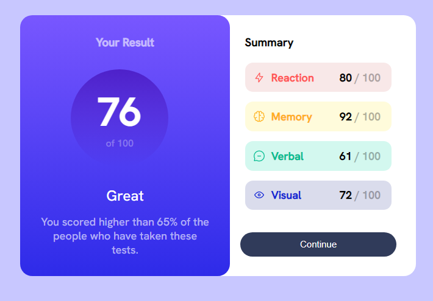

This a solution to the Results summary component challenge on Frontend Mentor

OVERVIEW

***Screenshot***



***Links***

Solution URL [](https://ejercicio-fr-result-summary-component.netlify.app/)

***Built with ***

-Semantic HTML5 markup
-CSS custom properties
-CSS Grid
-Mobile-first worflow

WHAT I LEARNED

In this project, I deepened my knowledge about the concept of  mobile-first with the correct use of media query. I also improved my use of the z-index concept and the correct handling of margins.

```css
.summary{
    background: hsl(0, 0%, 100%);
    width: 20rem;
    padding: 2rem;
    display: flex;
    flex-direction: column;
    position: relative;
    border-top-right-radius: 20px;
    border-bottom-right-radius: 20px;
    left: -15px; 
    z-index: 1;
}
@media(max-width: 640px){
    body{
        background-color: hsl(241, 100%, 89%);
    }
    .conteiner{
        flex-direction: column;
        justify-content: center;
        align-items: center;
    }
    .result{
        width: 24rem;
        display: flex;
        flex-direction: column;
        align-items: center;
    }
    .mobile{
        font-size: 15px;
        margin-top: 40px;
    }
    .mobile-2{
        font-size: 20px;
        margin-top: 150x;
    }
    .circle{
        margin: 0rem;
        height: 8rem;
        width: 8rem;
        margin-top: 20px;
    }
    .setentaYSeis{
        font-size: 3rem;
    }
    .summary{
        left: 0px;
        width: 24rem;
        border-radius: 0px;
        top: -15px;
    }
    .ancho{
        margin-right: 4rem;
    }
}
´´´

CONTINUED DEVELOPMENT

I want to continue deepening the realization of all kinds of frontend projects

AUTHOR

-Website- [Marcos Berta] (https://www.linkedin.com/in/marcos-berta-60a220225)
-Frontend Mentor -[mak2220](https://www.frontendmentor.io/profile/mak2220)